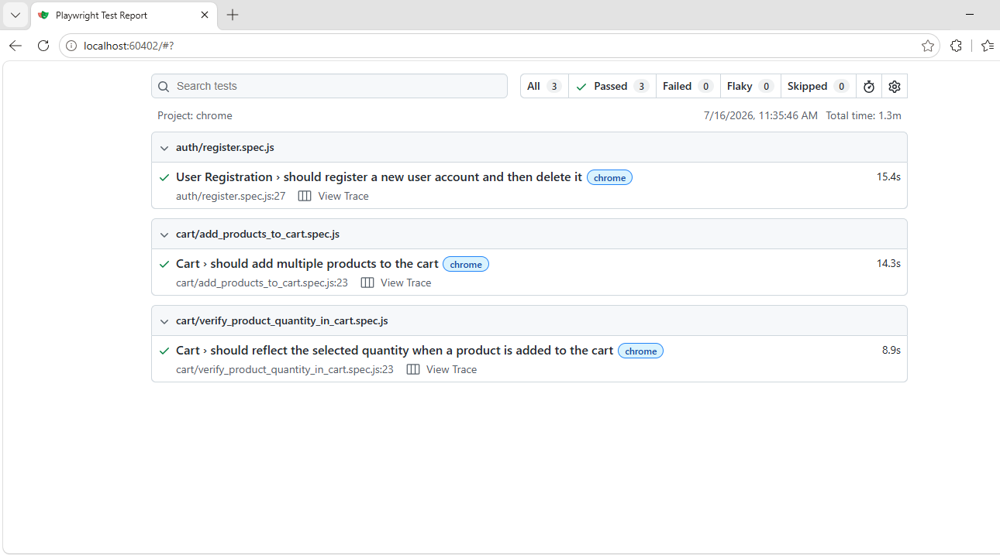
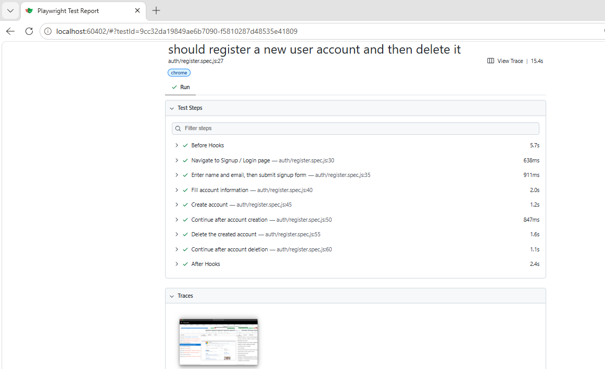

# AutomationExercise Playwright Framework

A production-ready Playwright automation framework (JavaScript / ES Modules) for
[automationexercise.com](http://automationexercise.com), built with the Page Object
Model and designed for maintainability, scalability, and readability.

## Tech Stack

- [Playwright Test](https://playwright.dev/)
- JavaScript (ES Modules) — no TypeScript, but type-checked via JSDoc (see below)
- Node.js
- [@faker-js/faker](https://fakerjs.dev/) for dynamic test data

## Project Structure

```
project-root/
├── openspec/
│   ├── register-user.md                     # Business specification for TC-001
│   ├── add-products-in-cart.md               # Business specification for TC-012
│   └── verify-product-quantity-in-cart.md    # Business specification for TC-013
├── tests/
│   ├── auth/
│   │   └── register.spec.js                  # Business-level test scenarios (assertions live here)
│   └── cart/
│       ├── add_products_to_cart.spec.js
│       └── verify_product_quantity_in_cart.spec.js
├── pages/
│   ├── BasePage.js               # Shared page behaviour (navigation, etc.)
│   ├── HomePage.js                # Home page locators & actions
│   ├── SignupLoginPage.js         # Signup / Login page locators & actions
│   ├── SignupPage.js              # Enter Account Information page locators & actions
│   ├── AccountPage.js             # Account Created / Account Deleted confirmation pages
│   ├── ProductsPage.js            # Products listing locators & actions
│   ├── ProductDetailsPage.js      # Single product details locators & actions
│   ├── CartPage.js                # Cart page locators & actions
│   └── components/                # Markup shared by more than one page
│       ├── ProductGrid.js         # Product-card grid (Home & Products pages)
│       └── CartConfirmationModal.js  # "Added to cart" modal (Products & Product Details pages)
├── fixtures/
│   └── users.js                   # Test data factories (returns a ready-to-use user object)
├── utils/
│   ├── faker.js                   # Random data generators (unique email, name, address, etc.)
│   ├── helpers.js                 # Small generic utilities (env var reading, etc.)
│   └── constants.js               # Shared constant values (messages, titles, timeouts)
├── playwright.config.js
├── jsconfig.json                  # Enables JSDoc-based type checking (checkJs) across the project
├── package.json
├── .env.example
├── .gitignore
└── README.md
```

## Folder Responsibilities

| Folder       | Responsibility |
|--------------|----------------|
| `openspec/`  | Business specifications (Gherkin-based) that define requirements before automation. See [OpenSpec Documentation](#openspec-documentation). |
| `tests/`     | Business-readable scenarios only. No locators, no low-level logic — just calls into page objects and assertions. |
| `pages/`     | One class per page/feature. Owns locators and page-level actions. Never contains `expect()` assertions. Markup shared by more than one page lives in `pages/components/`. |
| `fixtures/`  | Reusable/generated test data used by tests. |
| `utils/`     | Cross-cutting helpers that are not tied to a specific page (data generation, env config, constants). |

## Architecture Notes

- **Page Object Model**: every page exposes locators as readonly properties (set in the
  constructor) and behaviour as `async` methods. Tests never touch a locator directly.
- **Locator strategy**: locators prefer `getByRole()` → `getByLabel()` → `getByPlaceholder()`
  → `getByText()` → CSS, in that order. CSS (`[data-qa="..."]`) is used only where the site
  markup makes accessible locators unreliable — for example, the Address/Account Information
  form has duplicate `<label for="city">` associations for both the City and Zipcode fields,
  so `getByLabel()` cannot be trusted there. The site's own `data-qa` attributes exist
  specifically to support automation, and are the pragmatic, stable choice for that form.
- **Unique test data**: `utils/faker.js` generates a timestamp-based unique email on every
  run, so tests are idempotent and can be re-run without manual cleanup of test data.
- **Shared components**: markup that is reused verbatim across multiple pages (e.g. the
  product-card grid on the Home and Products pages, or the "Added to cart" confirmation modal on
  the Products and Product Details pages) is extracted into `pages/components/` and composed into
  the relevant Page Objects in their constructor. Page Objects still expose their own public
  methods (e.g. `addProductToCartAt()`), which delegate to the component internally — tests never
  reach into a component directly.
- **JSDoc typing**: every constructor, method, and generated data shape is documented with JSDoc
  (`@param`, `@returns`, typed object literals). `jsconfig.json` enables `checkJs`, so editors and
  `tsc --noEmit`-style tooling can type-check plain JavaScript without adopting TypeScript.
- **Stability practices**: `BasePage.goto()` waits for `domcontentloaded` rather than `load`, since
  the site's third-party ad/tracker scripts can stall the `load` event; page transitions triggered
  from a modal (e.g. `CartConfirmationModal`) assert the target element is visible before clicking
  it, so a failed transition surfaces as a clear assertion failure instead of a generic timeout.

## OpenSpec Documentation

Business requirements are captured in `openspec/` as Gherkin-based specifications, written before
any automation code. Each document describes one feature from a business perspective only —
actors, preconditions, business rules, and acceptance criteria — with no locators or
implementation details.

Each specification is identified by a Test Case ID (e.g. TC-001) that also appears in the file,
and maps to one automated spec, e.g. `openspec/register-user.md` (TC-001) informs
`tests/auth/register.spec.js`.

The intended workflow when adding a new test case is:

```
Business Requirement
        ↓
OpenSpec (openspec/*.md)
        ↓
Playwright Automation (tests/*.spec.js)
```

Write or update the OpenSpec document first, then implement the automated test to satisfy its
documented acceptance criteria.

## Installation

```bash
npm install
npx playwright install
```

Copy `.env.example` to `.env` if you want to override the default `BASE_URL`:

```bash
cp .env.example .env
```

## Running Tests

```bash
npm test              # run all tests headless
npm run test:headed   # run with a visible browser
npm run test:ui       # run with the Playwright UI runner
npm run test:debug    # run in debug/inspector mode
npm run test:auth     # run only the auth suite
npm run report        # open the last HTML report
npm run codegen       # launch Playwright codegen against automationexercise.com
```

## Test Result

All automated test scenarios were executed successfully using Playwright.





## Configuration

`playwright.config.js` is configured with:

- `baseURL` sourced from `BASE_URL` (env var, default `http://automationexercise.com`)
- Retries (`1` locally, `2` on CI)
- Screenshots on failure
- Video retained on failure
- Trace always captured
- HTML + list reporters
- Runs headed, in the `chrome` browser channel

## Adding a New Test

1. Create a new spec file under `tests/<feature>/<scenario>.spec.js`.
2. Import the page objects you need from `pages/`.
3. Describe the scenario using `test.describe` / `test` / `test.step`, keeping the test
   readable as a business flow.
4. Put all `expect()` assertions in the test file, not in the page object.

```js
import { test, expect } from '@playwright/test';
import { HomePage } from '../../pages/HomePage.js';

test('example scenario', async ({ page }) => {
  const homePage = new HomePage(page);
  await homePage.open();
  await expect(homePage.logo).toBeVisible();
});
```

## Adding a New Page Object

1. Create `pages/<PageName>.js` and extend `BasePage`.
2. Declare all locators in the constructor.
3. Add small, focused `async` methods for page actions (e.g. `fillLoginForm()`, `submit()`).
4. Do not add `expect()` assertions inside page objects — return locators so tests can
   assert on them.

```js
import { BasePage } from './BasePage.js';

export class ExamplePage extends BasePage {
  constructor(page) {
    super(page);
    this.submitButton = page.getByRole('button', { name: 'Submit' });
  }

  async submit() {
    await this.submitButton.click();
  }
}
```

### Extracting a Shared Component

If the same markup and behaviour appears on more than one page (as with the product-card grid or
the cart confirmation modal), extract it into a class under `pages/components/` instead of
duplicating locators. Have the relevant Page Objects instantiate the component in their
constructor and expose thin wrapper methods, so tests keep calling methods directly on the Page
Object rather than on the component.

## Test Data

`fixtures/users.js` exposes `createNewUser(overrides)`, which returns a fully populated,
randomly generated user (name, unique email, password, date of birth, address, etc.) backed
by `@faker-js/faker`. Pass an `overrides` object to customize any field for a specific test:

```js
const user = createNewUser({ country: 'Canada' });
```
